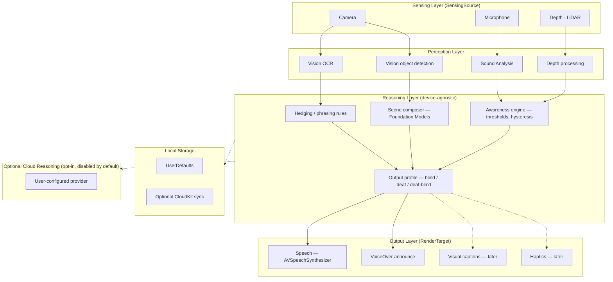

# SenseBridge

Open-source, on-device, private accessibility.

SenseBridge is a free, open-source iPhone app that translates a blind or
low-vision person's surroundings into clear spoken information, processing
everything on the device by default so the user's camera and surroundings
never have to leave their phone.

No competitor combines **open source + offline-by-default + user-controlled +
multi-sense architecture**. That combination — not raw scene-description
quality — is the wedge. See [`docs/PRODUCT.md`](docs/PRODUCT.md) for the full
positioning.

> Status: pre-launch. The app is under active development; there is no build
> to download yet. See [`docs/ROADMAP.md`](docs/ROADMAP.md) for the current
> phase.

**Links:** [Website](https://sensebridge.vercel.app) ·
[Docs](https://kevinle3212.github.io/sensebridge) ·
[Wiki](https://github.com/kevinle3212/sensebridge/wiki) ·
[Preview](https://sensebridge-preview.up.railway.app) ·
[Source](https://github.com/kevinle3212/sensebridge)

[](https://github.com/kevinle3212/sensebridge/actions/workflows/ci.yml)
[](https://github.com/kevinle3212/sensebridge/actions/workflows/security.yml)
[](https://github.com/kevinle3212/sensebridge/actions/workflows/codeql.yml)
[](https://github.com/kevinle3212/sensebridge/actions/workflows/pages.yml)
[](https://github.com/kevinle3212/sensebridge/actions/workflows/website-ci.yml)
[](https://github.com/kevinle3212/sensebridge/actions/workflows/railway-deploy-check.yml)
[](https://github.com/kevinle3212/sensebridge/actions/workflows/react-doctor.yml)
[](https://github.com/kevinle3212/sensebridge/actions/workflows/wiki-sync.yml)
[](https://github.com/kevinle3212/sensebridge/actions/workflows/github-models.yml)
[](https://github.com/kevinle3212/sensebridge/actions/workflows/dependabot-automerge.yml)
[](https://github.com/kevinle3212/sensebridge/actions/workflows/graphify.yml)
[](https://github.com/kevinle3212/sensebridge/actions/workflows/copilot-setup-steps.yml)
[](LICENSE)
[](https://github.com/kevinle3212/sensebridge/stargazers)
[](https://github.com/kevinle3212/sensebridge/commits/main)
[](https://github.com/kevinle3212/sensebridge/issues)

## Table of Contents

- [Scope (MVP)](#scope-mvp)
- [Explicitly out of scope for now](#explicitly-out-of-scope-for-now)
- [System Architecture](#system-architecture)
- [Repository Structure](#repository-structure)
- [Build and Run](#build-and-run)
- [Knowledge Graph (Graphify)](#knowledge-graph-graphify)
- [Documentation](#documentation)
- [GitHub Platform](#github-platform)
- [Contributing](#contributing)
- [Testing](#testing)
- [License](#license)
- [Governance and Security](#governance-and-security)

## Scope (MVP)

The current build targets **blind and low-vision users, on iPhone, on-device,
via VoiceOver**:

- Reading printed text and documents aloud.
- Identifying common objects and surfaces.
- Describing a scene in a natural sentence.
- Cautious obstacle awareness using LiDAR (never navigation — see
  [`docs/SAFETY-FRAMING.md`](docs/SAFETY-FRAMING.md)).
- Awareness of important sound events.

## Explicitly out of scope for now

Deferred by design, not by oversight — see
[`docs/ROADMAP.md`](docs/ROADMAP.md) for when and why:

- Deaf and deaf-blind user support (different sensing/rendering problems;
  later phases).
- Wearables and AR glasses (Apple Watch, Vision Pro, Meta glasses).
- Facial recognition and enrollment (deferred behind a careful consent flow;
  biometric law exposure).
- Any backend, account system, or cloud processing. There is no server, and
  that absence is deliberate.
- Real-time turn-by-turn navigation guidance. SenseBridge provides cautious,
  probabilistic *awareness*, never safety or navigation guarantees.

## System Architecture

Native Swift/SwiftUI. Device-specific perception and output are isolated
behind protocols (`SensingSource`, `RenderTarget`) so the reasoning core stays
device-agnostic — see [`docs/ARCHITECTURE.md`](docs/ARCHITECTURE.md) for the
full rationale, data flows, and the on-device AI pipeline.



No network round-trip happens for perception or reasoning unless the user
explicitly opts into the cloud adapter — see
[`docs/PRIVACY.md`](docs/PRIVACY.md).

## Repository Structure

```text
.
├── app/                      Native Swift/SwiftUI iOS app
│   ├── SenseBridge/           App target: App, Features/*, Accessibility, Resources
│   ├── SenseBridge.xcodeproj/ Xcode project
│   ├── SenseBridgeTests/      Unit tests
│   ├── SenseBridgeUITests/    UI / VoiceOver tests
│   └── Packages/SenseBridgeCore/  SPM package (Sources/Tests)
├── website/                  Public marketing site (Astro, static, pre-launch)
├── docs/                     Product, architecture, safety, privacy, testing, tooling docs
│   └── planning/               Original planning documents
├── models/                   Bundled on-device model licenses and provenance
├── security/                 Threat model, pre-merge security checklist
├── audits/                   Append-only audit reports (accessibility, safety-framing, docs, general)
├── legal/                    Privacy policy, terms, disclaimer (owner-approval only)
├── scripts/                  setup.sh, lint.sh
├── tools/                    Sensitive-file scan, skill-mirror sync, wiki-home generator
├── skills/                   Reusable project skills
├── docker/                   Website container build (Railway deploy)
├── _bmad/                    BMAD-METHOD planning scaffold
├── .github/                  CI, security, Pages, Wiki sync, Models, Copilot, Dependabot, templates
├── .agents/ .claude/ .codex/ .gemini/ .cursor/  Per-agent config, all deferring to AGENTS.md
├── graphify-out/             Generated knowledge graph (gitignored, see below)
└── AGENTS.md CLAUDE.md ...   Root orientation and agent-instruction docs
```

<details>
<summary>App target map</summary>

```text
app/SenseBridge/
├── App/                     App entry point, AppEnvironment (DI container)
├── Accessibility/           VoiceOver, Dynamic Type, haptic pattern helpers
├── Features/
│   ├── Reading/               Read printed text/documents aloud
│   ├── Labeling/               Identify common objects and surfaces
│   ├── SceneDescription/       Natural-sentence scene description
│   ├── ObstacleAwareness/      Cautious LiDAR-based awareness (never navigation)
│   └── SoundAlerts/            Sound-event awareness
└── Resources/               Localizable strings, asset catalog
```

</details>

## Build and Run

The Xcode project lives under [`app/`](app/) (native Swift/SwiftUI, no
external framework dependencies for the MVP — see
[`docs/ARCHITECTURE.md`](docs/ARCHITECTURE.md)). Development and on-device
testing require a Mac and Xcode; a LiDAR-equipped iPhone (12 Pro or later) is
needed to exercise obstacle awareness, and model-latency benchmarking should
be done on the newest iPhone you have access to. See
[`docs/ENVIRONMENT.md`](docs/ENVIRONMENT.md) for setup and
[`scripts/setup.sh`](scripts/setup.sh) for the bootstrap script. Distributing
builds to other testers (TestFlight/App Store) requires the paid Apple
Developer Program — see [`docs/DISTRIBUTION.md`](docs/DISTRIBUTION.md).

## Knowledge Graph (Graphify)

The repository maintains a [graphify](https://github.com/safishamsi/graphify)
knowledge graph in `graphify-out/` (git-ignored, generated) — an AST-only,
API-cost-free index that powers codebase-wide questions, cross-file
relationship lookups, and a wiki-style community view under
`graphify-out/wiki/`. It rebuilds automatically after every local commit and
branch switch via `.githooks/post-commit`/`post-checkout` (see
[`docs/TOOLING.md`](docs/TOOLING.md)), and the
[`Graphify Knowledge Graph`](.github/workflows/graphify.yml) workflow rebuilds
it on `main` and uploads a downloadable artifact — advisory only, it never
blocks a merge.

| Task | Command |
| --- | --- |
| Build the graph from scratch | `graphify .` |
| Update after code changes | `graphify update .` |
| Ask a natural-language question | `graphify query "<question>"` |
| Explain a single concept | `graphify explain "<concept>"` |
| Watch and rebuild live | `graphify watch .` |

## Documentation

| Doc | Covers |
| --- | --- |
| [`docs/PRODUCT.md`](docs/PRODUCT.md) | Vision, personas, funding, differentiators |
| [`docs/ROADMAP.md`](docs/ROADMAP.md) | Five-phase roadmap, MVP definition, open questions |
| [`docs/ARCHITECTURE.md`](docs/ARCHITECTURE.md) | System design, protocols, data flow |
| [`docs/AI-MODELS.md`](docs/AI-MODELS.md) | On-device model choices and licenses |
| [`docs/SAFETY-FRAMING.md`](docs/SAFETY-FRAMING.md) | The awareness-not-safety doctrine |
| [`docs/ACCESSIBILITY.md`](docs/ACCESSIBILITY.md) | VoiceOver testing and labeling standards |
| [`docs/PRIVACY.md`](docs/PRIVACY.md) | On-device data handling guarantees |
| [`docs/TESTING.md`](docs/TESTING.md) | Test strategy, including field testing with blind users |
| [`docs/ENVIRONMENT.md`](docs/ENVIRONMENT.md) | Dev environment setup |
| [`docs/DISTRIBUTION.md`](docs/DISTRIBUTION.md) | TestFlight / App Store distribution |
| [`docs/FAQ.md`](docs/FAQ.md) | Common questions |
| [`docs/TOOLING.md`](docs/TOOLING.md) | Tooling decisions (global vs. project) |

The full index, including root orientation docs (`PROJECT_OVERVIEW.md`,
`GAPS.md`, `MEMORY.md`, `LEARNING.md`), lives in [`WIKI.md`](WIKI.md), and the
same content is published to
[GitHub Pages](https://kevinle3212.github.io/sensebridge) and the
[GitHub Wiki](https://github.com/kevinle3212/sensebridge/wiki) on every push
to `main`.

## GitHub Platform

| Feature | Where |
| --- | --- |
| CI (build, test, lint) | [`.github/workflows/ci.yml`](.github/workflows/ci.yml) |
| Security scanning (secrets, dependencies, SAST) | [`.github/workflows/security.yml`](.github/workflows/security.yml) |
| Code scanning (CodeQL) | [`.github/workflows/codeql.yml`](.github/workflows/codeql.yml) → [Security tab](https://github.com/kevinle3212/sensebridge/security/code-scanning) |
| Dependabot | [`.github/dependabot.yml`](.github/dependabot.yml) → [Dependabot alerts](https://github.com/kevinle3212/sensebridge/security/dependabot) |
| Secret scanning | [Security tab](https://github.com/kevinle3212/sensebridge/security/secret-scanning) (native GitHub feature, public repo) |
| Security advisories | [Advisories](https://github.com/kevinle3212/sensebridge/security/advisories) |
| Security policy | [`SECURITY.md`](SECURITY.md) |
| Pages (docs site) | [`.github/workflows/pages.yml`](.github/workflows/pages.yml) → [kevinle3212.github.io/sensebridge](https://kevinle3212.github.io/sensebridge) |
| Wiki | [`.github/workflows/wiki-sync.yml`](.github/workflows/wiki-sync.yml) → [GitHub Wiki](https://github.com/kevinle3212/sensebridge/wiki) |
| GitHub Models prompt evaluation | [`.github/workflows/github-models.yml`](.github/workflows/github-models.yml), [`.github/prompts/`](.github/prompts/) |
| Copilot coding agent | [`.github/workflows/copilot-setup-steps.yml`](.github/workflows/copilot-setup-steps.yml) |
| Claude Code review | [`.github/workflows/claude-code-review.yml`](.github/workflows/claude-code-review.yml), [`.github/workflows/claude.yml`](.github/workflows/claude.yml) |
| Projects | [Project boards](https://github.com/kevinle3212/sensebridge/projects) |
| Issue / PR templates | [`.github/ISSUE_TEMPLATE/`](.github/ISSUE_TEMPLATE/), [`.github/PULL_REQUEST_TEMPLATE.md`](.github/PULL_REQUEST_TEMPLATE.md) |

## Contributing

See [`CONTRIBUTING.md`](CONTRIBUTING.md) for setup, build, test, and PR
process, and [`CODE_OF_CONDUCT.md`](CODE_OF_CONDUCT.md) for community
standards. Accessibility regressions are treated as the most serious kind of
bug — every PR must state its accessibility impact.

[`CLAUDE.template.md`](CLAUDE.template.md) is a starter template for your own
user-global `~/.claude/CLAUDE.md`, not a repo instruction file — no agent
reads it in this repository. Copy it if you want a starting point:
`cp CLAUDE.template.md ~/.claude/CLAUDE.md`.

## Testing

| Layer | Tests |
| --- | --- |
| Unit / integration | Swift Testing, XCTest — see [`docs/TESTING.md`](docs/TESTING.md) |
| E2E | XCUITest, three per feature (happy path / error / edge case) |
| Accessibility | VoiceOver pass on every changed screen; zero unlabeled elements is a hard gate |
| Static analysis | SwiftLint, SwiftFormat (`scripts/lint.sh`), CodeQL, Semgrep, OSV-Scanner |
| Website | ESLint, Stylelint, Prettier, pa11y-ci, React Doctor — see `website/README.md` |

## License

Apache 2.0 — see [`LICENSE`](LICENSE). Every bundled model's license is vetted
and recorded in [`models/README.md`](models/README.md); SenseBridge never
bundles AGPL or non-commercial-research-only components (see
[`docs/AI-MODELS.md`](docs/AI-MODELS.md)).

## Governance and Security

This is currently a solo-maintained project — see
[`GOVERNANCE.md`](GOVERNANCE.md). Report vulnerabilities privately per
[`SECURITY.md`](SECURITY.md); see [GitHub Platform](#github-platform) above
for the full security surface (code scanning, secret scanning, advisories).

---

Need help? See [`SUPPORT.md`](SUPPORT.md).
